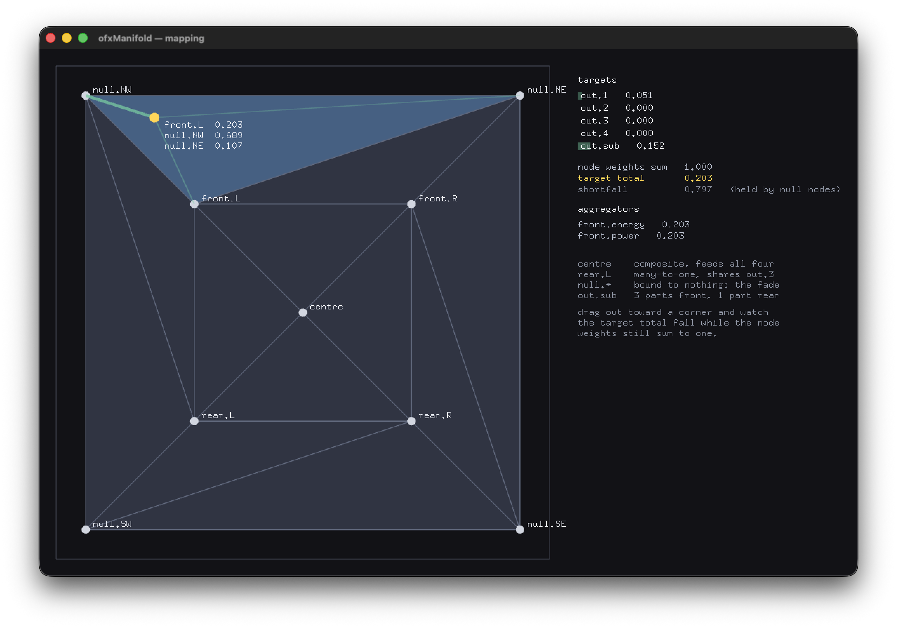

# ofxManifold

**Continuous preset morphing for openFrameworks.**

Place your presets as nodes. Drag a point between them. Get a weighted blend.



*`example-mapping`: the point sits out among the null nodes ringing the edge.
The node weights still sum to 1.000, but the resolved targets total only 0.303
— the missing 0.697 is held by nodes bound to nothing. That shortfall is the
fade, and it is the reason silent nodes were invented.*

```cpp
ofxManifold::Manifold2D m;
auto a = m.addNode("calm",   {0.2f, 0.8f});
auto b = m.addNode("bright", {0.8f, 0.8f});
auto c = m.addNode("heavy",  {0.5f, 0.2f});
m.addTriangle(a, b, c);

ofxManifold::Evaluator ev(m);
auto e = ev.evaluate({0.45f, 0.6f});                 // point -> weights

MyPreset blended = interpolate(e.weights, presets);  // weights + values
```

The manifold never learns what a `MyPreset` is. It answers *which nodes
influence this point, and by how much*. Everything after that is interpretation.

---

## What it is for

A single continuous gesture can drive several independent things at once —
synthesis parameters, rhythmic density, colour, lighting, speaker gains, OSC
output — without any of them being hardcoded into the thing producing the
gesture.

Spatial audio panning is the historically important application and the
narrowest one. If you have four presets you like and want to move smoothly
between them, that is the same problem.

---

## Lineage, and what is owed to whom

This is an independent implementation of an idea with a long history. It
carries no code from the work below.

**Steve Ellison** devised barycentric amplitude panning in 1986 for a
sixteen-channel geodesic dome in Canberra. The dome's triangular arrangement
suggested panning between *triplets* of loudspeakers, and barycentric
coordinates turned out to be a cheap way to derive power-preserving gains from
it. He arrived at the technique intuitively and learned only later that Möbius
had introduced the mathematics in 1827.

The software became SpaceNodes, then SpaceMap, commercialized through LCS Audio
and later Meyer Sound across four hardware generations. His account of it —
*SpaceMap: 20 Years of Audio Origami*, Lighting & Sound America, April 2013 —
is the reason several decisions here are what they are. Every feature in
SpaceMap exists because a production broke without it, which makes the feature
set evidence rather than one arrangement among many.

**Zachary Seldess** reimplemented the approach for Max/MSP and Pure Data as
**MIAP — Manifold-Interface Amplitude Panning**, presented at the AES 137th
Convention in 2014, and generalized it considerably in the process. His paper
and externals are at **[zacharyseldess.com](https://www.zacharyseldess.com)**,
and anyone working in Max or Pd should go there rather than here.

Three things in MIAP shaped this addon directly.

**It generalized the approach past panning.** MIAP interpolates between HRTFs,
between reverb impulse responses, across VST parameter sets — the weights are
treated as influence over *whatever* sits at each node, and speaker gain is one
case among several. Seldess has said the non-panning use cases were a large part
of why he committed to the project, alongside making the manifold approach known
outside the small circle of theatrical sound designers working on very expensive
systems. That generalization is the premise this addon starts from rather than
something it arrived at.

**The response curve is selectable** — cosine, square root, linear — precisely
because the weights might be driving plugin parameters or lighting-board faders
rather than audio, where constant-power is meaningless or actively wrong.

**Non-centricity.** Unlike VBAP or Ambisonics, the map need not be a projection
of physical space and need not assume a listener at the origin. Two nodes
adjacent on the map may be the two most distant outputs in the room.

MIAP has since generalized further, from triangles to **polysets** of N ≥ 3
nodes using **mean-value coordinates** — a generalized barycentric scheme that
reduces exactly to ordinary barycentric coordinates at N = 3.

> **Try it:** Seldess's [interactive demo](https://www.zacharyseldess.com/miap/panning.html)
> lets you drag a source through a polyset and watch each node's influence
> resolve in real time. It is the fastest way to understand what a manifold
> does, and it shows the idea through speaker gains. ofxManifold isolates the
> step before that — the weights themselves — and leaves what they mean to
> whatever consumes them.

**Scot Gresham-Lancaster's** Tibetan Yantra map, described in Ellison's
article, is the clearest demonstration that the geometry is genuinely
independent of spatial meaning: intersections in a diagram assigned to eight
real channels with every other intersection virtual, producing sheets and
planes of sound collapsing into points rather than movement from A to B.

---

## How this differs

Not better, and not a wider scope — MIAP already generalized past panning. The
differences are of host, packaging, and where the seams fall.

**Different host.** MIAP is a set of Max/MSP and Pd externals. This is a C++
library for openFrameworks, usable from any C++ project. If you are working in
Max or Pd, MIAP is the mature tool and you should use it.

**No audio at all.** MIAP interpolates non-audio parameters, but it lives in an
audio environment and panning is first-class in it. There is no audio code
anywhere in this addon, and the square-root conversion to constant-power gains
is one optional curve among several rather than the default path.

**Blending arbitrary values is a first-class operation.** `interpolate()` takes
weights and *any* C++ type supporting `+` and `* float` — a colour, a struct of
parameters, a `glm::vec3` — so a blended value comes back in the consumer's own
type rather than as a list of gains to distribute.

**The node taxonomy collapses to cardinality.** MIAP has Speaker, Silent,
Virtual and Derived node types. Here the kernel has **no node type field at
all**: terminal, null and composite nodes are the same struct, differing only
in whether the mapping layer resolves them to zero, one, or many targets. And a
Derived node — which runs the routing backwards, receiving a sum rather than
distributing one — is not a node here. It is an aggregator, a separate object
outside the geometry, because a non-participating object *inside* the geometry
forces every region operation to filter it out.

**The kernel has no openFrameworks dependency and is proved independently.**
`src/core` builds and tests with a compiler and `make`. Every layer is verified
against a second implementation written in Python from a *different
formulation* — Cramer's rule against signed sub-areas, edge-sign containment
against barycentric non-negativity, the standard library's JSON parser against
a hand-written one. Agreement is evidence rather than a tautology.

**Triangles only, for now.** MIAP's mean-value coordinates handle polygons of
any size; this handles triangles. `Region` is an interface so a second
coordinate kernel can be added without touching anything downstream, but that
is future work rather than a claim (see `ROADMAP.md`).

**A manifold and a mapping are separate files.** A manifold is portable; a
mapping is installation-specific. That split is what lets a recorded path
survive a change of venue: the map is rebuilt for the new rig and the cues are
not touched.

---

## Install

```
cd openFrameworks/addons
git clone https://github.com/leeMeredith/ofxManifold.git
```

Then add `ofxManifold` in Project Generator. No dependencies beyond
openFrameworks itself. glm is vendored only so the kernel tests build without
an openFrameworks checkout.

---

## Examples

**`example-basic`** — drag the point, watch the weights. Drag a *node* and
watch it refuse to move when it would turn a region inside out. Three fixtures:
a clean fan, a deliberately broken T-junction, and two overlapping regions where
the answer depends on which side you entered from.

**`example-spread`** — one slider from pinpoint to wash. The node weights stay
at 1.000 the whole way; the resolved targets fall, because spread hands weight
to the null nodes too and they discard it. Nothing was told to fade.

**`example-blend`** — two manifolds stacked in one square, one point evaluated
against both, one crossfade combining them by target name. Hold the point still
and sweep the crossfade: every output changes while the point has not moved.
That is the third axis — two 2D maps combined downstream, which is how SpaceMap
reached three dimensions rather than with tetrahedra.

**`example-trajectory`** — the touring case. Record a path by dragging, play it
back, then swap the venue underneath it *while it is still playing*. The dot
traces the same shape; every node has moved, so the weights reorganize around a
gesture that has not changed. This is why the manifold lives in normalized
coordinates rather than pixels.

**`example-parameter-morphing`** — four presets at four nodes, each an ordinary
struct. Every field interpolates independently.

**`example-mapping`** — the node taxonomy made visible. A ring of null nodes
around the edge, a composite node feeding four outputs at once, two nodes
sharing one target, and aggregators running the routing backwards. Drag toward
a corner and watch the resolved target total fall while the node weights still
sum to one. That shortfall is the fade.

---

## Testing

```
make test
```

Vectors are classed by where their authority comes from:

| Class | Authority | A failure means |
|---|---|---|
| `ANALYTIC` | the mathematics itself | the arithmetic is wrong |
| `CROSS` | an independent implementation | the two disagree |
| `SPEC` | a rule we invented | we are inconsistent with ourselves |

238 vectors across six suites, plus 36 mutation gates that introduce known
faults and require each to be caught — because a suite that has never gone red
is an assertion rather than a check. CI runs on Linux x86_64 and macOS arm64,
which has twice caught floating-point differences invisible on one platform
alone.

`DECISIONS.md` records the reversals and what forced each one. `ROADMAP.md`
records what is next and what is deliberately parked.

---

## Layout

```
src/core/            kernel, glm only, no ofMain.h
src/interpretation/  curves, spread, blend, interpolate
src/mapping/         node to target bindings, aggregators
src/io/              JSON manifold and mapping files
src/ofx/             the ONLY place ofMain.h may appear
tests/               references, vectors, fixtures
libs/glm/            vendored, see libs/VENDORED.md
```

`make headers` enforces the boundary: it fails if anything outside `src/ofx`
includes `ofMain.h`, and compiles every kernel header standalone.

To use the kernel without openFrameworks, include the headers under `src/core`
directly.

---

## Guiding principle

> **The manifold describes relationships, not meanings.**

A point has a location. A node has an identity. A region defines interpolation.
The evaluator produces a weight vector. Everything after that is interpretation.

---

MIT licensed. See `LICENSE`.
